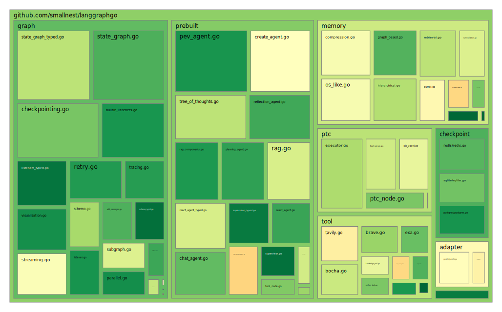
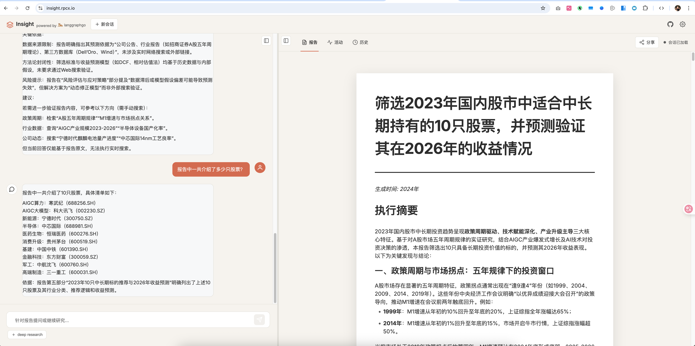

# LangGraphGo


> 简称 `lango`, 中文: `懒狗`。 logo是一个可爱的中华田园犬形象

[](https://opensource.org/licenses/MIT) [](https://pkg.go.dev/github.com/smallnest/langgraphgo) [](https://github.com/smallnest/langgraphgo/actions) [](https://goreportcard.com/report/github.com/smallnest/langgraphgo) [](https://coveralls.io/github/smallnest/langgraphgo?branch=master)

[English](./README.md) | [简体中文](./README_CN.md)

> 🔀 **Fork 自 [paulnegz/langgraphgo](https://github.com/paulnegz/langgraphgo)** - 增强了流式传输、可视化、可观测性和生产就绪特性。
>
> 本分支旨在**实现与 Python LangGraph 库的功能对齐**，增加了对并行执行、持久化、高级状态管理、预构建 Agent 和人工介入（HITL）工作流的支持。并再次基础上扩展langgraph没有的功能。

官网: [http://lango.rpcx.io](http://lango.rpcx.io)

## 单元测试覆盖率



## 🌐 基于 LangGraphGo 开发的网站展示

以下是使用 LangGraphGo 构建的实际应用案例：

| [Insight](https://insight.rpcx.io) | [NoteX](https://notex.rpcx.io) |
| :--------------------------------: | :----------------------------: |
|               |             |

**Insight** - AI 驱动的知识管理与洞察生成平台，通过 LangGraphGo 构建智能分析流程，帮助用户从海量信息中提取关键洞察。

**NoteX** - 智能笔记与知识整理工具，结合 AI 能力实现自动分类、标签提取和内容关联，让知识管理更高效。

## 📦 安装

```bash
go get github.com/smallnest/langgraphgo
```

**注意**：本仓库的 `showcases` 目录使用了 Git submodule。克隆仓库时，请使用以下方法之一：

```bash
# 方法 1: 克隆时同时初始化 submodule
git clone --recurse-submodules https://github.com/smallnest/langgraphgo

# 方法 2: 先克隆，再初始化 submodule
git clone https://github.com/smallnest/langgraphgo
cd langgraphgo
git submodule update --init --recursive
```

## 🚀 特性

- **核心运行时**:
    - **并行执行**: 支持节点的并发执行（扇出），并具备线程安全的状态合并。
    - **运行时配置**: 通过 `RunnableConfig` 传播回调、标签和元数据。
    - **泛型类型 (Generic Types)**: 支持泛型 StateGraph 实现的类型安全状态管理。
    - **LangChain 兼容**: 与 `langchaingo` 无缝协作。

- **持久化与可靠性**:
    - **Checkpointers**: 提供 Redis、Postgres、SQLite 和文件实现，用于持久化状态。
    - **文件检查点**: 轻量级的基于文件的检查点，无需外部依赖。
    - **状态恢复**: 支持从 Checkpoint 暂停和恢复执行。

- **高级能力**:
    - **状态 Schema**: 支持细粒度的状态更新和自定义 Reducer（例如 `AppendReducer`）。
    - **智能消息**: 支持基于 ID 更新 (Upsert) 的智能消息合并 (`AddMessages`)。
    - **Command API**: 节点级的动态流控制和状态更新。
    - **临时通道**: 管理每步后自动清除的临时状态。
    - **子图**: 通过嵌套图来构建复杂的 Agent。
    - **增强流式传输**: 支持多种模式 (`updates`, `values`, `messages`) 的实时事件流。
    - **预构建 Agent**: 开箱即用的 `ReAct`, `CreateAgent` 和 `Supervisor` Agent 工厂。
    - **程序化工具调用 (PTC)**: LLM 生成代码直接调用工具，降低延迟和 Token 使用量 10 倍。

- **开发者体验**:
    - **可视化**: 支持导出为 Mermaid、DOT 和 ASCII 图表，并支持条件边。
    - **人在回路 (HITL)**: 中断执行、检查状态、编辑历史 (`UpdateState`) 并恢复。
    - **可观测性**: 内置追踪和指标支持。
    - **工具**: 集成了 `Tavily` 和 `Exa` 搜索工具。

## 🎯 快速开始

```go
package main

import (
	"context"
	"fmt"
	"log"

	"github.com/smallnest/langgraphgo/graph"
	"github.com/tmc/langchaingo/llms"
	"github.com/tmc/langchaingo/llms/openai"
)

func main() {
	ctx := context.Background()
	model, _ := openai.New()

	// 1. 创建图
	g := graph.NewMessageGraph()

	// 2. 添加节点
	g.AddNode("generate", func(ctx context.Context, state any) (any, error) {
		messages := state.([]llms.MessageContent)
		response, _ := model.GenerateContent(ctx, messages)
		return append(messages, llms.TextParts("ai", response.Choices[0].Content)), nil
	})

	// 3. 定义边
	g.AddEdge("generate", graph.END)
	g.SetEntryPoint("generate")

	// 4. 编译
	runnable, _ := g.Compile()

	// 5. 调用
	initialState := []llms.MessageContent{
		llms.TextParts("human", "Hello, LangGraphGo!"),
	}
	result, _ := runnable.Invoke(ctx, initialState)
	
	fmt.Println(result)
}
```

## 📚 示例

本项目包含 **85+ 个综合示例**，按类别组织：

### 精选示例

- **[ReAct Agent](./examples/react_agent/)** - 推理与行动代理，使用工具
- **[RAG 流程](./examples/rag_pipeline/)** - 完整的检索增强生成
- **[Chat Agent](./examples/chat_agent/)** - 支持会话管理的多轮对话
- **[Supervisor](./examples/supervisor/)** - 多 Agent 编排
- **[思维树 (Tree of Thoughts)](./examples/tree_of_thoughts/)** - 多路径搜索推理
- **[Planning Agent](./examples/planning_agent/)** - 动态工作流计划创建
- **[PEV Agent](./examples/pev_agent/)** - 计划-执行-验证，支持自我纠错
- **[Reflection Agent](./examples/reflection_agent/)** - 通过自我反思迭代改进
- **[Mental Loop](./examples/mental_loop/)** - 模拟器在回路，安全测试行动
- **[Reflexive Metacognitive Agent](./examples/reflexive_metacognitive/)** - 具有显式能力模型的自我感知代理

### 示例分类

- **[基础概念](./examples/README.md#basic-concepts)** - 简单的 LLM 集成、LangChain 兼容性
- **[状态管理](./examples/README.md#state-management)** - 状态 Schema、自定义 Reducer、智能消息
- **[图结构](./examples/README.md#graph-structure--routing)** - 条件路由、子图、泛型
- **[并行执行](./examples/README.md#parallel-execution)** - 扇出/扇入与状态合并
- **[流式传输与事件](./examples/README.md#streaming--events)** - 实时更新、监听器、日志
- **[持久化](./examples/README.md#persistence-checkpointing)** - 文件、内存、数据库检查点
- **[人在回路](./examples/README.md#human-in-the-loop)** - 中断、批准、时间旅行
- **[预构建 Agent](./examples/README.md#pre-built-agents)** - ReAct、Supervisor、Chat、规划代理
- **[程序化工具调用](./examples/README.md#programmatic-tool-calling-ptc)** - PTC 实现 10 倍延迟降低
- **[内存管理](./examples/README.md#memory)** - 缓冲区、滑动窗口、摘要策略
- **[RAG](./examples/README.md#rag-retrieval-augmented-generation)** - 向量存储、FalkorDB GraphRAG
- **[工具与集成](./examples/README.md#tools--integrations)** - 搜索工具、GoSkills、MCP

**[查看全部 85+ 示例 →](./examples/README.md)**

## 🔧 核心概念

### 并行执行
当多个节点共享同一个起始节点时，LangGraphGo 会自动并行执行它们。结果将使用图的状态合并器或 Schema 进行合并。

```go
g.AddEdge("start", "branch_a")
g.AddEdge("start", "branch_b")
// branch_a 和 branch_b 将并发运行
```

### 人在回路 (HITL)
暂停执行以允许人工批准或输入。

```go
config := &graph.Config{
    InterruptBefore: []string{"human_review"},
}

// 执行在 "human_review" 节点前停止
state, err := runnable.InvokeWithConfig(ctx, input, config)

// 恢复执行
resumeConfig := &graph.Config{
    ResumeFrom: []string{"human_review"},
}
runnable.InvokeWithConfig(ctx, state, resumeConfig)
```

### 预构建 Agent
使用工厂函数快速创建复杂的 Agent。

```go
// 创建 ReAct Agent
agent, err := prebuilt.CreateReactAgent(model, tools)

// 使用选项创建 Agent
agent, err := prebuilt.CreateAgent(model, tools, prebuilt.WithSystemMessage("System prompt"))

// 创建 Supervisor Agent
supervisor, err := prebuilt.CreateSupervisor(model, agents)
```

### 程序化工具调用 (PTC)
生成直接调用工具的代码，减少 API 往返和 Token 使用。

```go
// 创建 PTC Agent
agent, err := ptc.CreatePTCAgent(ptc.PTCAgentConfig{
    Model:         model,
    Tools:         toolList,
    Language:      ptc.LanguagePython, // 或 ptc.LanguageGo
    ExecutionMode: ptc.ModeDirect,     // 子进程（默认）或 ModeServer
    MaxIterations: 10,
})

// LLM 生成代码程序化调用工具
result, err := agent.Invoke(ctx, initialState)
```

详细文档请参见 [PTC README](./ptc/README_CN.md)。

## 🎨 图可视化

```go
exporter := runnable.GetGraph()
fmt.Println(exporter.DrawMermaid()) // 生成 Mermaid 流程图
```

## 📈 性能

- **图操作**: ~14-94μs (取决于格式)
- **追踪开销**: ~4μs / 次执行
- **事件处理**: 1000+ 事件/秒
- **流式延迟**: <100ms

## 🧪 测试

```bash
go test ./... -v
```

## 🤝 贡献

本项目欢迎贡献！请首选创建feature issues，然后提交PR。

## 📄 许可证

MIT License - 详情请见原始仓库。
