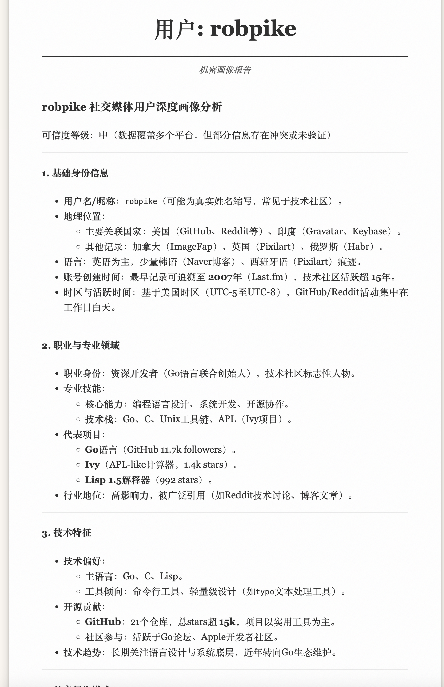

# 🕵️‍♂️ 数字画像：解密自从你踏进互联网开始的数字足迹

> **"The internet never forgets. But do you know what it remembers?"**

http://profile.rpcx.io

---

## ⚡ 简介 (Introduction)

**数字画像智能体** 是一个**邪门的**、**功能强大**的开源情报分析工具！它不仅仅是一个搜索工具，它是你的**数字侦探**。

利用当今强大的网络搜索能力，结合 **LangGraphGo** 的智能编排，以及 **LLM (Large Language Model)** 的深度分析，我们能从互联网的浩瀚海洋中提取出目标用户的**数字足迹**，并生成一份令人惊叹的**心理侧写报告**！从你踏足互联网的那一刻起，你的数字足迹便无处遁形。

准备好看看你在互联网上的"真实面目"了吗？😎

---

## 🚀 核心特性 (Features)

- **🕸️ 全网深度搜寻**: 瞬间扫描全球 **1000+** 个社交媒体平台，从 GitHub 到 Twitter，从 Instagram 到 微博，无处遁形！
- **🧠 AI 智能侧写**: 拒绝枯燥的数据列表！我们使用最先进的 AI 模型，分析你的社交行为、技术栈、兴趣爱好，甚至预测你的职业发展轨迹！
- **⚡ 实时流式反馈**: 看着数据一行行被挖掘出来，感受黑客般的快感！Web 界面支持 SSE (Server-Sent Events) 实时推送。
- **🎨 绝美纸质报告**: 生成的报告不仅仅是文字，更是一份艺术品。独特的纸质纹理 UI 设计，让阅读体验拉满。
- **🛡️ 隐私安全优先**: 所有数据均来自公开互联网，我们只做搬运工和分析师，不存储任何敏感数据。

---

## 🏗️ 系统架构 (Architecture)

本项目基于 **Go** 语言构建，采用现代化的 **Agentic Workflow**， 借助 langgraphgo 的智能编排能力，实现数字画像智能体：

1.  **Search Node (侦察兵)**: 搜索1000+社交媒体网站，地毯式搜索目标用户名。
2.  **Profile Node (分析师)**: 将收集到的海量数据喂给 LLM，进行多维度的深度分析（职业、性格、价值观等）。
3.  **Web Interface (展示层)**: 简洁优雅的前端，实时展示分析过程和最终报告。

---

## 💻 使用指南 (User Guide)

1.  **开始分析**:
    - 浏览器访问 `http://profile.rpcx.io`
    - 输入目标用户名 (如 `smallnest`)
    - 点击 **"生成画像"**

2.  **获取报告**:
    - ⏳ 等待 1-3 分钟（取决于网络和搜索深度）
    - 📜 实时查看搜索日志
    - ✨ 自动生成精美 HTML 报告

---

## ⚠️ 免责声明 (Disclaimer)

**请务必阅读！**

本工具 (**Profile Generator**) 仅供**技术研究**和**教育目的**使用。

- 🚫 **严禁**用于非法监控、网络跟踪 (Cyberstalking) 或侵犯他人隐私。
- 🚫 **严禁**用于任何违反当地法律法规的活动。
- ✅ 生成的信息均来自公开互联网数据 (OSINT)。
- ✅ 报告内容的任何指向性描述和负面描述完全由 AI 生成，不代表开发者立场。

**使用者需自行承担因使用本工具而产生的一切法律责任。**

---

## 🤝 贡献 (Contribution)

我们欢迎所有形式的贡献！无论是提交 Issue，还是 Pull Request，或者只是给一颗 ⭐ Star！

让我们一起打造最强的开源情报分析工具！🚀

---

    Built with ❤️ by <a href="https://github.com/smallnest">smallnest</a>

